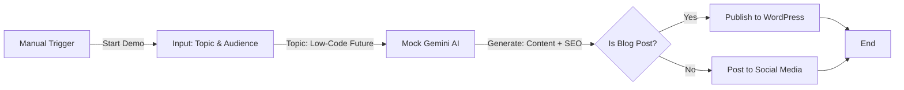

# AI Content Generation System (Demo)

**Workflow ID**: `t5NDwzGN7Vcjy4AZ`
**Category**: AI Content
**Status**: 🟢 Ready for Demo

## Overview

This workflow showcases how to build an automated content factory using Gemini AI. It takes a topic and parameters, generates a complete blog post with SEO metadata, and simulates publishing it to a CMS or social media.

## Workflow Logic

## Demo Instructions

1. Open **"Demo - AI Content Generation System"**.
2. Click **Execute Workflow**.
3. Explore the nodes:
   - **Input Parameters**: Shows the defined topic ("Future of Low-Code").
   - **Mock Gemini AI**: Displays the generated markdown content and SEO title.
   - **Mock WordPress Publish**: Shows the "published" URL status.

## Real-World Implementation

To convert to production:

1. **Trigger**: Replace Manual with **Schedule** (e.g., "Every Monday") or **Airtable Trigger**.
2. **AI**: Replace Mock Node with **Google Gemini** node.
3. **CMS**: Replace Mock WordPress with actual **WordPress** or **Webflow** node to create live posts.
