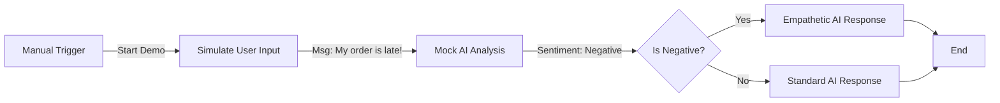

# AI Customer Support Bot (Demo)

**Workflow ID**: `6bH3V8dlue45mqJy`
**Category**: Client Integration
**Status**: 🟢 Ready for Demo

## Overview

This workflow demonstrates how an AI-powered chatbot handles customer support inquiries. It simulates the process of receiving a message, analyzing sentiment, and generating an appropriate response—all without requiring actual external API credentials for the demo.

## Workflow Logic

## Demo Instructions

1. Go to your n8n workflows dashboard.
2. Open **"Demo - AI Customer Support Bot"**.
3. Click the **Execute Workflow** button at the bottom.
4. Watch the flow execute successfully (all nodes turn green).
5. Click on the final node to see the "Generated Response".

## Nodes Configuration (Demo)

- **Simulate User Input**: Sets a sample angry customer message about a late order.
- **Mock AI Analysis**: Simulates OpenAI output, assigning "negative" sentiment and "order_status" intent.
- **Is Negative?**: Routing logic that detects the negative sentiment.
- **Empathetic Response**: Generates a priority escalation message because the sentiment was negative.

## Real-World Implementation

To convert this demo into a production workflow:

1. Replace **Manual Trigger** with **Webhook/Chat Trigger**.
2. Replace **Mock AI Analysis** with an **OpenAI** node (Model: GPT-4).
3. Connect **Empathetic Response** to an **Email** or **Chat** node to send the reply.
