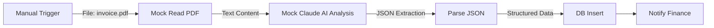

# Document Analysis AI (Demo)

**Workflow ID**: `5Aem50x8PvuNgnFW`
**Category**: Data Processing
**Status**: 🟢 Ready for Demo

## Overview

This workflow demonstrates how to automate data extraction from documents like invoices, contracts, or resumes using Claude AI. It simulates reading a PDF, extracting structured data, and saving it to a database.

## Workflow Logic

## Demo Instructions

1. Open **"Demo - Document Analysis AI"**.
2. Click **Execute Workflow**.
3. Inspect the steps:
   - **Mock Read PDF**: Shows simulated OCR text from an invoice.
   - **Mock Claude AI**: Shows the JSON object extracted by the AI (Invoice #, Date, Amount).
   - **Parse JSON**: Converts the string to a valid JSON object.
   - **Mock DB Insert**: Confirms the record was "saved".

## Real-World Implementation

To convert to production:

1. **Trigger**: Use **Google Drive**, **OneDrive**, or **Email** trigger to detect new files.
2. **Read File**: Use **Read Binary File** node → **Text Extraction** (e.g., PDF to Text).
3. **AI**: Connect **Anthropic** node with a prompt like: *"Extract the invoice number, date, and total amount from this text as JSON"*.
4. **Database**: Connect to **PostgreSQL**, **MySQL**, or **Airtable**.
