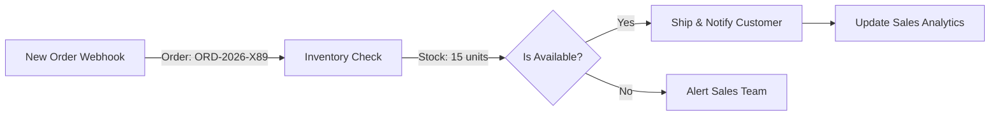

# E-Commerce Automation (Demo)

**Workflow ID**: `L7tMKdvpfbud88yB`
**Category**: Business Operations
**Status**: 🟢 Ready for Demo

## Overview

This workflow demonstrates an end-to-end e-commerce fulfillment process. It simulates receiving a new order, checking inventory in a database, and executing conditional logic to either ship the product or alert the sales team of a stockout.

## Workflow Logic

## Demo Instructions

1. Open **"Demo - E-Commerce Automation"**.
2. Click **Execute Workflow**.
3. Follow the flow:
   - **Simulate New Order**: Sets the order context (Total: $149.99).
   - **Mock Inventory**: Confirms "available" status.
   - **Ship & Notify**: Simulates sending a shipping email + DHL label.
   - **Update Analytics**: Logs the sale to Google Sheets.

## Real-World Implementation

To convert to production:

1. **Trigger**: Connect to **Shopify**, **WooCommerce**, or **Stripe** webhook.
2. **Inventory**: Connect to **Airtable**, **PostgreSQL**, or **Google Sheets**.
3. **Shipping**: Use **ShipStation** or **EasyPost** nodes.
4. **Notifications**: Enable **Slack**, **Email**, or **SMS** (Twilio) nodes.
