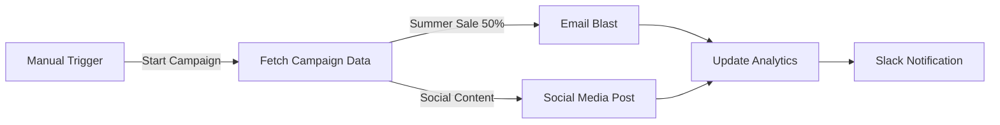

# Marketing Automation Suite (Demo)

**Workflow ID**: `I36Ba4JvIXYYjG3j`
**Category**: Marketing
**Status**: 🟢 Ready for Demo

## Overview

This workflow demonstrates a multi-channel marketing campaign automation. It simulates fetching campaign details from a spreadsheet and orchestrating simultaneous blasts to Email (Mailchimp/SendGrid) and Social Media (Twitter/LinkedIn), followed by analytics updates.

## Workflow Logic

## Demo Instructions

1. Open **"Demo - Marketing Automation Suite"**.
2. Click **Execute Workflow**.
3. Watch the orchestration:
   - **Fetch Campaign Data**: Retrieves "Summer AI Sale 2026" details.
   - **Mock Email Campaign**: Simulates sending to 1,542 recipients.
   - **Mock Social Posting**: Simulates API calls to Twitter & LinkedIn.
   - **Update Sales Analytics**: Logs the campaign run.
   - **Slack Notification**: Alerts the team that campaign is live.

## Real-World Implementation

To convert to production:

1. **Trigger**: Use **Schedule Trigger** (e.g., Weekly) or **Airtable** "New Record" trigger.
2. **Email**: Connect **Mailchimp**, **SendGrid**, or **Customer.io**.
3. **Social**: Connect **Twitter**, **LinkedIn**, or **Facebook** nodes.
4. **Analytics**: Connect to **Google Analytics 4** or **mixpanel**.
